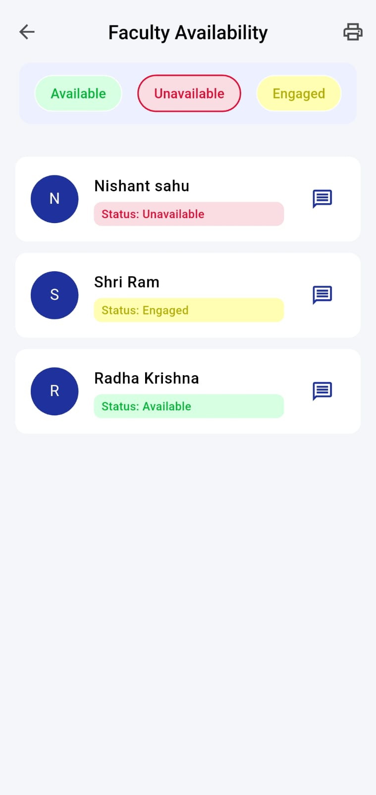

# Shiksha Sanchalan 🎓✨

**Shiksha Sanchalan** is a modern, cross-platform mobile application designed to streamline and automate the complex administrative tasks of examination management in educational institutions. Built with Flutter and powered by Firebase, it provides a real-time, centralized platform for both administrators and faculty to manage their duties with efficiency and transparency.

## 📸 Screenshots

Here's a glimpse of the app's clean and intuitive user interface, designed for both light and dark modes.





---

## ✨ Key Features

This application is packed with features to solve real-world problems in academic administration:

* **Role-Based Access Control:** Separate, tailored interfaces and functionalities for **Admin** and **Faculty** roles.
* **Real-time Faculty Availability:** Faculty can set their status (Available, Unavailable, Engaged) with a single tap, which is reflected instantly for admins. Includes search, filtering, and PDF report generation.
* **Smart Duty Assignment:** Admins can assign invigilation duties only to available faculty. The assignment automatically updates the faculty's status to "Engaged" and sends a real-time push notification with duty details.
* **Dynamic Seating Arrangement:** A powerful tool to generate complex, multi-branch seating plans. The system prevents students of the same branch from being seated adjacently and generates a shareable PDF.
* **Dynamic Timetable Management:** An intuitive interface to create full examination timetables for different semesters and branches, complete with a PDF export feature.
* **Complete User Management:**
    * Secure sign-up, login, and password reset functionality.
    * Admins can view all users and manage roles (promote to admin/demote to faculty).
    * Users can manage their own profiles, including uploading and removing profile pictures.
* **Real-time Notifications:** A dedicated notification screen with a badge system to alert users of important events (new duties, status changes) and differentiate between read and unread notifications.
* **Modern UI with Theming:** A beautiful, user-friendly interface with full support for both **Light and Dark modes**.

---

## 🛠️ Tech Stack

* **Frontend:** Flutter (Dart)
* **Backend & Database:** Firebase
    * **Authentication:** For secure user sign-up and login.
    * **Firestore:** As the primary real-time, NoSQL database for all application data.
    * **Cloud Functions for Firebase (Node.js):** For secure, server-side logic including:
        * Sending targeted push notifications.
        * Securely handling user account deletion.
    * **Firebase Storage:** For storing user-uploaded profile pictures.
* **State Management:** Provider

---

## 🚀 Getting Started

To get a local copy up and running, follow these simple steps.

### Prerequisites

* Flutter SDK: [Install Flutter](https://flutter.dev/docs/get-started/install)
* A Firebase project with the Blaze plan enabled (for Cloud Functions).

### Installation

1.  **Clone the repo**
    ```sh
    git clone [https://github.com/your-username/shiksha-sanchalan.git](https://github.com/your-username/shiksha-sanchalan.git)
    ```
2.  **Navigate to the project directory**
    ```sh
    cd shiksha-sanchalan
    ```
3.  **Install Flutter packages**
    ```sh
    flutter pub get
    ```
4.  **Set up Firebase**
    * Follow the instructions to add this app to your Firebase project.
    * Download your `google-services.json` file and place it in the `android/app/` directory.
5.  **Run the app**
    ```sh
    flutter run
    ```

### Backend Setup (Cloud Functions)

The backend logic for notifications and secure account deletion resides in the `functions` directory.

1.  **Navigate to the functions directory**
    ```sh
    cd functions
    ```
2.  **Install npm dependencies**
    ```sh
    npm install
    ```
3.  **Deploy the functions to your Firebase project**
    ```sh
    firebase deploy --only functions
    ```

---
## 🔮 Future Scope

* **One-on-One Chat:** Implement a real-time chat feature between admins and faculty.
* **Advanced Analytics:** Create a dedicated reporting section for admins to view statistics on faculty duties and room usage.
* **Offline Support:** Integrate Firestore's offline capabilities to allow users to view essential data without an internet connection.